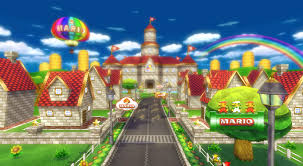
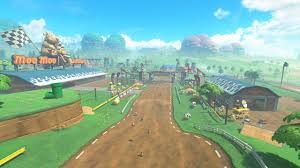
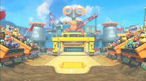
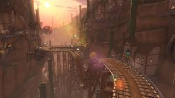
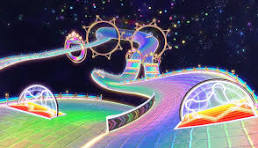

<h1>Desafio de projeto do Felipão: Alterando o Mario Kart JS</h1>

  <table>
        <tr>
            <td>
                
            </td>
            <td>
                <b>Contexto:</b>

                <p>Foi desenvolvido uma lógica de um jogo de vídeo game para simular corridas de Mario Kart, o desafio é implementar novas funcionalidades para ele. O projeto inicial se encontra na branch <a href="https://github.com/Sandro-Pimentel/MarioKartJS/tree/base"> base </a> e o link para o repositório do instrutor que criou esse <a href="https://github.com/digitalinnovationone/formacao-nodejs/tree/main/03-projeto-mario-kart"> projeto base.</a> Essa branch tem uma visao geral do produto final, caso queira ver especificamente as features adicionadas verifique a branch <a href="https://github.com/Sandro-Pimentel/MarioKartJS/tree/alteracoes"> alteracoes. </a></p>

            </td>
            <td> </td>
        </tr>
    </table>

<h2>Players</h2>
    <table style="border-collapse: collapse; width: 800px; margin: 0 auto;">
        <tr>
            <td style="border: 1px solid black; text-align: center;">
                <p>Mario</p>
                
            </td>
            <td style="border: 1px solid black; text-align: center;">
                <p>Velocidade: 4</p>
                <p>Manobrabilidade: 3</p>
                <p>Poder: 3</p>
            </td>
             <td style="border: 1px solid black; text-align: center;">
                <p>Peach</p>
                
            </td>
            <td style="border: 1px solid black; text-align: center;">
                <p>Velocidade: 3</p>
                <p>Manobrabilidade: 4</p>
                <p>Poder: 2</p>
            </td>
              <td style="border: 1px solid black; text-align: center;">
                <p>Yoshi</p>
                
            </td>
            <td style="border: 1px solid black; text-align: center;">
                <p>Velocidade: 2</p>
                <p>Manobrabilidade: 4</p>
                <p>Poder: 3</p>
            </td>
        </tr>
        <tr>
            <td style="border: 1px solid black; text-align: center;">
                <p>Bowser</p>
                
            </td>
            <td style="border: 1px solid black; text-align: center;">
                <p>Velocidade: 5</p>
                <p>Manobrabilidade: 2</p>
                <p>Poder: 5</p>
            </td>
            <td style="border: 1px solid black; text-align: center;">
                <p>Luigi</p>
                
            </td>
            <td style="border: 1px solid black; text-align: center;">
                <p>Velocidade: 3</p>
                <p>Manobrabilidade: 4</p>
                <p>Poder: 4</p>
            </td>
            <td style="border: 1px solid black; text-align: center;">
                <p>Donkey Kong</p>
                
            </td>
            <td style="border: 1px solid black; text-align: center;">
                <p>Velocidade: 2</p>
                <p>Manobrabilidade: 2</p>
                <p>Poder: 5</p>
            </td>
        </tr>
        <tr>
            <td style="border: 1px solid black; text-align: center;">
                <p>Toad</p>
                
            </td>
            <td style="border: 1px solid black; text-align: center;">
                <p>Velocidade: 3</p>
                <p>Manobrabilidade: 4</p>
                <p>Poder: 3</p>
            </td>
        </tr>
    </table>

<p></p>

<h2>Pistas</h2>
    <table style="border-collapse: collapse; width: 800px; margin: 0 auto;">
        <tr>
            <td style="border: 1px solid black; text-align: center;">
                <p>Mario Circuit - 1 rodada</p>
                
            </td>
             <td style="border: 1px solid black; text-align: center;">
                <p>Moo Moo Meadows - 3 rodadas</p>
                
            </td>
            <td style="border: 1px solid black; text-align: center;">
                <p>Toad's Factory - 5 rodadas</p>
                
            </td>
        </tr>
        <tr>
            <td style="border: 1px solid black; text-align: center;">
                <p>Wario's Gold Mine - 7 rodadas</p>
                
            </td>
            <td style="border: 1px solid black; text-align: center;">
                <p>Rainbow Road - 10 rodadas</p>
                
            </td>
        </tr>
    </table>

<h3>🕹️ Regras & mecânicas:</h3>

<b>Jogadores:</b>

<ul>
  <li><label for="jogadores-item">O Computador deve receber dois personagens para disputar a corrida em um objeto cada</label></li>
  <li><label for="jogadores-item">É possível escolher dois personagens para disputar a corrida através do prompt de comando</label></li>
</ul>

<b>Pistas:</b>

<ul>
  <li><label for="pistas-1-item">É possível escolher entre 5 pistas pré-estabelecidas, escolher uma aleatoriamente ou gerar uma pista aleatória</label></li>
  <li><label for="pistas-2-item">As pistas pré-estabelecidas já possuem seus blocos de RETA, CURVA e CONFRONTO</label></li>
  <li><label for="pistas-2-item">As pistas geradas aleatoriamente podem possuir de 1 a 10 rodadas, com cada rodada sendo um bloco de RETA, CURVA ou CONFRONTO escolhido aleatoriamente</label></li>
</ul>

<b>Itens:</b>

<ul>
    <li><label for="itens-1-item">Existem 3 itens no confronto:</label></li>
    <ul>
        <li><b>🐢 Casco: </b> Tira um ponto do perdedor do CONFRONTO</li>
        <li><b>💣 Bomba: </b> Tira dois pontos do perdedor do CONFRONTO</li>
        <li><b>🍄 Cogumelo: </b> Adiciona um ponto para o vencedor do CONFRONTO</li>
    </ul>
</ul>

<b>Regras:</b>

<ul>
    <li><label for="itens-1-item">Se o corredor que perdeu o confronto tem 0 pontos, nenhum item é recebido</label></li>
</ul>

<input type="checkbox" id="vitoria-item" />
<label for="vitoria-item">Ao final, vence quem acumulou mais pontos</label>

<h1> Como rodar </h1>

Ao baixar o projeto instale as dependências com:
```
npm install
```

Para rodar a aplicação use o comando:

```
npm run start
```
